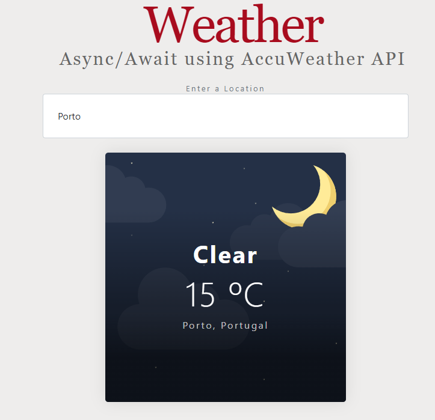
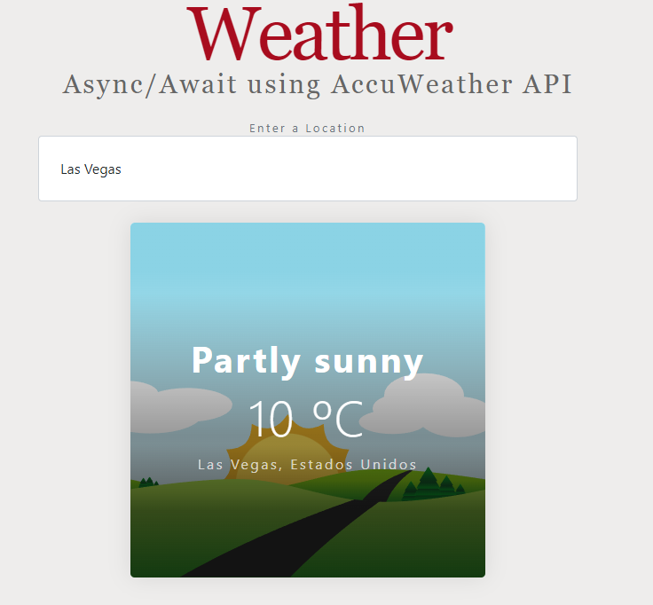

<!-- PROJECT LOGO -->
<br />
<div align="center">
 

  <h3 align="center">One of my first projects using async/await</h3>

</div>

<!-- GETTING STARTED -->
## Getting Started

### Installation
1. Clone the repo
   ```sh
   git clone https://github.com/jfilipeferreira96/Weather-App-Consuming-AccuWeather-API.git
   ```
2. You can now run the project by opening index.html


### If the API key is expired:
3. Create an account and get a free API Key at [https://developer.accuweather.com/](https://developer.accuweather.com/)


4. Enter your API in `js/api.js`
   ```js
   const key = 'ENTER YOUR API';
   ```

<p align="right">(<a href="#top">back to top</a>)</p>

<!-- ABOUT THE PROJECT -->
## About The Project
<p align="center">




<p align="right">(<a href="#top">back to top</a>)</p>


